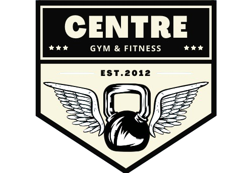

Este proyecto es una aplicación web sobre un Gimnacio.

    
    <h1>Gym Centre</h1>
    

    Gym centre es el principal referente en Argentina en el ámbito del fitness. Se destaca por ofrecer las más destacadas ofertas y descuentos en un amplio catálogo de servicios y equipamiento de última generación.
     
    <a href=''>
    <strong>Explorar pagina » </strong>
    </a>
     
     
    <a href=''>
    Reportar un problema
    </a>
    ·
    <a href=''>
    Solicitar una mejora
    </a>
    ·
    <a href=''>
    Soporte
    </a>
    

## Aplicación Web con React y Vite

Esta aplicación realizada en forma grupal corresponde al Proyecto Final del curso Desarrollador Full Stack dictado por RollingCodeSchool.

## Enunciado - Requerimientos

Página principal:
   * Contendrá información destacada del gimnasio.
   * Servicios ofrecidos.
   * Productos disponibles en el gimnasio.
   * Publicidad de marcas asociadas.
   * Comentarios de clientes.
   * Información sobre los profesores.
   * Tres planes de entrenamiento mensual:
   * Plan solo musculación.
   * Plan solo clases.
   * Plan Full.
   * Información del clima actual, tomada de una API confiable.

Navbar:
   * Logo de la empresa.
   * Botón de login.
   * Opciones adicionales para administradores: administración de usuarios y clases.

Footer:
   * Redes sociales del gimnasio.
   * Ubicación.
   * Teléfonos.
   * Información adicional.
   * Página de detalle de planes:
   * Al seleccionar un plan, se muestra un formulario de consulta.
   * Respuesta automática al mail del solicitante usando la librería EmailJS (opcional).

Login:
   * Página o ventana modal.
   * Permitir login de al menos el administrador.
   * Contraseña del administrador encriptada usando bcryptjs.

Página principal del administrador:
   * Bienvenida al administrador.
   * Información de la versión del sistema (opcional).
   * Clases disponibles del día y usuarios anotados.

Menú con nuevas opciones al ingresar como administrador:
   * Administrar clases: CRUD de clases.
   * Administrar usuarios: CRUD de usuarios (opcional).

Administrar Clases:
   * Detalle de la clase.
   * Profesor/a.
   * Fecha.
   * Hora.

Administrar Usuarios (opcional):
   * Nombre.
   * Apellido.
   * Email.
   * Teléfono.
   * Plan contratado.
   * Datos adicionales si se considera necesario.

Páginas Informativas:

Página acerca de nosotros:
   * Información del equipo desarrollador.
   * Frase sobre el equipo.
   * Galería con foto/avatar y nombre de cada miembro.
   * Página de error 404:
   * Diseñada para ser llamada desde enlaces sin funcionalidad establecida.

Página de contacto:
   * Formulario completamente validado.

## Requisitos Optativos:

Registro de usuarios y reserva de turnos:
   * Registro y login de usuarios.
   * Reservar clases sin recurrir al administrador.

CRUD de Productos:
   * Administración de productos ofrecidos en el gimnasio.
   * CRUD completo de productos por el administrador.

## Deploy de la aplicación

La aplicación está desplegada en Netlify. Puedes acceder haciendo clic en el siguiente enlace:

🔗 [Centre - GYM](netlify.com"...")

## Repositorio Backend

* #### Repositorio Backend: [backendProyectoFinal]( Repositorio Backend: [backendProyectoFinal](.....link de repo backend...))

## Tecnologías utilizadas

  
  
  
  
  
  
  
  

  * ### Otras:

    - [React-Router-Dom](https://reactrouter.com/en/main/start/tutorial) 
    - [React-Hook-Form](https://react-hook-form.com/get-started)
    - [SweetAlert2](https://sweetalert2.github.io/#download)
    - [Json-server](https://github.com/typicode/json-server)

## Requisitos previos

- Node.js instalado en tu sistema. Puedes descargarlo [aquí](https://nodejs.org/).

## Instalacion y uso

1. Clona este repositorio en tu máquina local a través de una terminal:

  * git clone <[url-del-repositorio](...)>

2. Navega al directorio del proyecto:

  * cd ProyectoFinalRC-Front

3. Instala las dependencias del proyecto:

  * npm install o npm i

4. Crea un archivo .env en la raíz del proyecto y configura las variables de entorno necesarias. Aquí hay un ejemplo:

* VITE_API_CLASES=url

## Autores
_Fernandez Fausto Fidel_

- Github: https://github.com/faustofern7

## 📞 Contactanos

| Medio    | Link                                   |
| -------- | -------------------------------------- |
| Email    | gymcentre@gmail.com                   |
| Twitter  | https://twitter.com/gymcentre         |
| Linkedin | https://www.linkedin.com/in/gymcentre |

## Licencia

codigo y documentacion copyright 2023-2024 de los autores de Gym Centre

